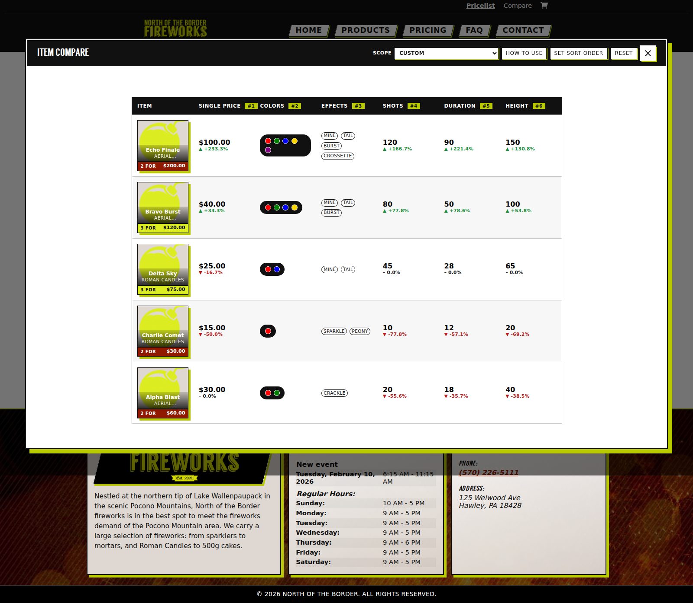
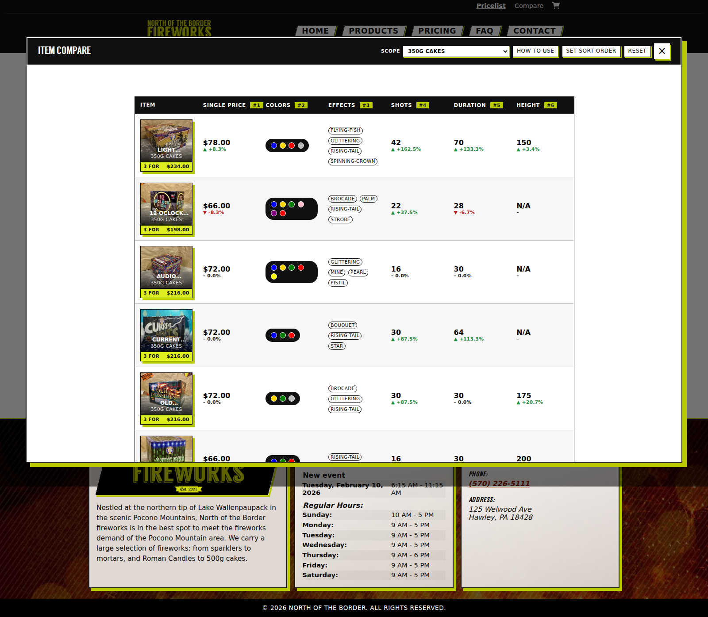
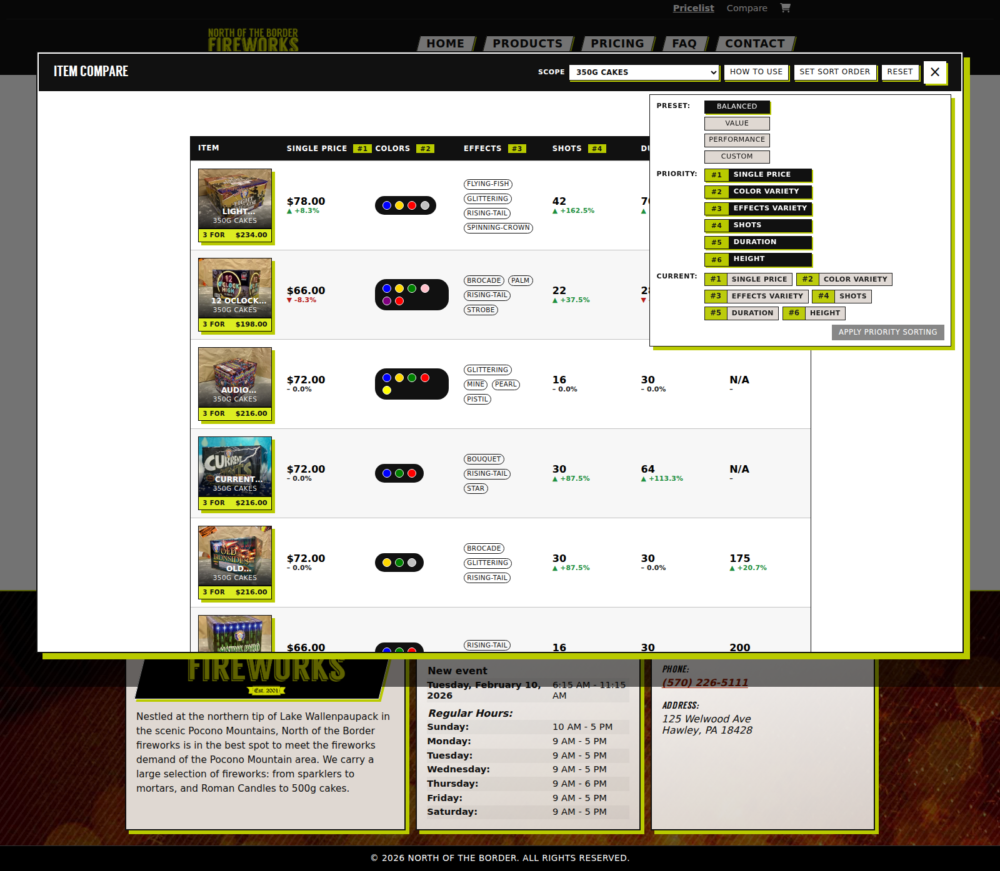
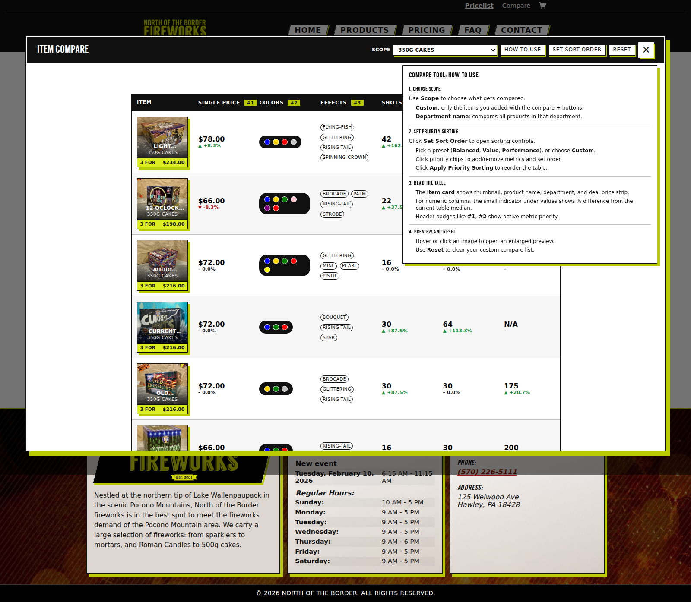

# Compare Modal: How to Use

This guide explains the compare experience in detail, including scope selection, sorting priorities, and reading compare metrics.

## Overview

The compare modal lets you:

- Compare your own selected products (`Custom` scope)
- Compare an entire department (`Scope` dropdown)
- Reorder products using weighted priority sorting
- Preview item images and key deal details quickly

## Header Controls

### Scope

Use the `Scope` dropdown to choose what is included in the table:

- `Custom` (default): uses only items you've added to compare.
- `<Department Name>`: compares all products in that department.

### How to Use

Click `How to Use` to open the in-app instructions panel.

### Set Sort Order

Click `Set Sort Order` to open sorting controls.

- Presets:
  - `Balanced`
  - `Value`
  - `Performance`
- `Custom`: manually pick and order priority metrics.
- `Apply Priority Sorting`: applies the draft priorities and reorders rows.

### Reset

`Reset` clears the custom compare selection list.

## Sorting Details

The compare sorter supports these metrics:

- Single Price
- Color Variety
- Effects Variety
- Shots
- Duration
- Height

How it works:

- Selected metrics are ranked `#1`, `#2`, etc.
- Higher-priority metrics receive higher weight.
- Lower single price is treated as better value; other numeric/variety metrics rank higher as better.
- Rows animate into new positions after applying sort priorities.

## Table Reading Guide

### Item Column

Each row includes:

- Thumbnail
- Product name
- Department label
- Deal strip (`2 FOR` or `3 FOR`) with deal price

### Numeric Columns

For single price, shots, duration, and height:

- Main value appears on top
- Difference indicator below shows arrow and % delta versus current table median

### Variety Columns

- Colors: rendered with color-dot pills
- Effects: rendered as effect chips

## Interaction Notes

- Hover or click item image to open enlarged preview.
- Scope changes can dramatically change table size and medians.
- Priority badges in table headers show active applied order.

## Screenshots

### Compare modal (default)

### Department scope selected

### Sort order popover

### How to Use panel

